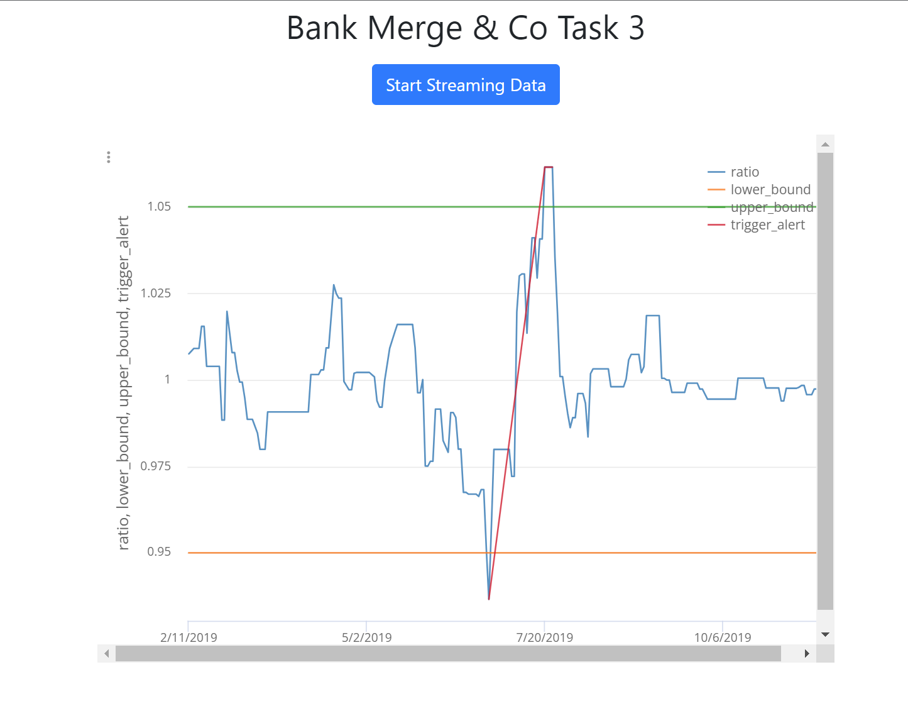
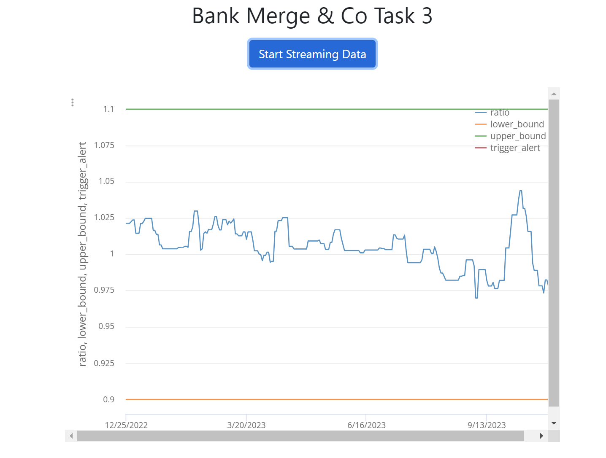

# JPMC Task 3
Starter repo for task 3 of JPMC's Forage program

## Purpose
You will use perspective to generate a live graph that displays the data feed in a clear and visually appealing way for traders to monitor.

Recall that the purpose of this graph is to monitor and determine when a trading opportunity may arise as a result of the temporary weakening of a correlation between two stock prices. Given this graph, the trader should be able to quickly and easily notice when the ratio moves too far from the average historical correlation. In the first instance, we'll assume that threshold is +/-10% of the 12-month historical average ratio.

## Acceptance Criteria

This ticket is done when the numbers from the python script render properly in the live perspective graph. That means the ratio between the two stock prices is tracked and displayed, the upper and lower bounds are shown on the graph, and an alert is shown whenever the bounds are crossed.

## Implemented
- A graph more useful to traders by making it track the ratio between two stocks over time and NOT the two stocks’ top_ask_price.

- Traders want to monitor the ratio of two stocks
against a historical correlation with upper and lower bounds. This can
help them determine a trading opportunity. Therefore we also want to make
this graph .plot the upper and lower bounds and show when they get
crossed using a trigger alert.

## Implemented Screenshots

- At +/-5% threshhold of historical average (example to show alert)

- At +/-10% threshhold of historical average (implemented solution per requirement)

